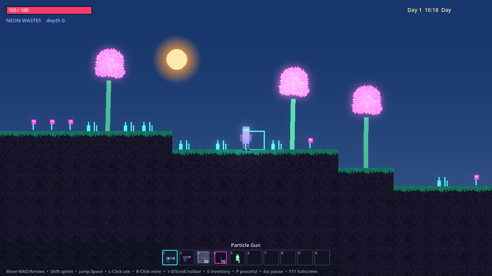
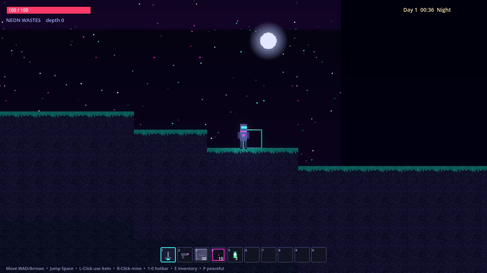

# Exocraft

A sci-fi / cyberpunk sandbox inspired by Terraria, built in **Godot 4.6**. Dig
and build across an **endless, procedurally generated alien world** with multiple
biomes, mine ores, craft gear, and fight off alien crawlers and sentry drones.

All art is **pixel art generated at runtime** (see `scripts/autoload/Art.gd`) — the
project ships with zero binary image assets, so it is fully deterministic and easy
to restyle. Drop in hand-drawn PNGs later without touching gameplay code.




## Running

1. Open the project folder in Godot 4.6 (`Import` → select `project.godot`).
2. Press **F5** (Play).

Or from the command line:

```bash
godot --path .
```

## Controls

| Action            | Key                              |
| ----------------- | -------------------------------- |
| Move              | `A` / `D` or `←` / `→`           |
| Jump              | `Space` / `W` / `↑`              |
| Use selected item | **Left click**                   |
| Mine (always)     | **Right click**                  |
| Select hotbar     | `1` – `0` or **mouse wheel**     |
| Inventory + craft | `E` or `Tab`                     |
| Peaceful mode     | `P` (toggle enemies on/off)      |
| Sprint            | hold `Shift`                     |
| Pause menu        | `Esc`                            |
| Fullscreen        | `F11`                            |

"Use selected item" depends on what is in the active hotbar slot:

- **Plasma Drill** (tool) – mine the tile under the cursor
- **Ion Blaster** (weapon) – fire an energy bolt toward the cursor
- **Block** – place it under the cursor (needs an adjacent solid tile)
- **Med-Cell** (consumable) – restore health

## Features

- **Endless world** streamed in 16×16-tile chunks around the player. Edits persist
  in memory; generation is deterministic per world seed.
- **Four surface biomes** chosen by low-frequency noise — Neon Wastes, Cryo Tundra,
  Glass Dunes, Toxic Jungle — plus an underground Slate layer that turns into the
  Obsidite biome at depth, threaded with caves and ore veins.
- **Per-biome surface life**: harvestable **alien trees** (glowing neon canopies,
  crystalline ice trees, glass succulents, toxic spore-trees) that drop wood when
  cut with the particle gun, plus **non-solid decorations** (biome grass tufts,
  rocks, flowers, mushrooms) the player walks straight through. Harvested trees
  stay gone; everything else regenerates with the chunk.
- **Ores**: Ferralite (metal), Vyrite (crystal) and Ion ore (energy, glowing),
  gated by depth and rarity.
- **Mining & building** with reach limits, hardness-based dig times, placement
  support checks, and item drops that fall and magnetise to the player. You can
  only mine **exposed** blocks (one block deep at a time), so no reaching through
  solid rock.
- **Particle-gun mining**: a beam from the gun dissolves the target block
  pixel-by-pixel as you mine, and the dissolved bits stream back into the gun as
  glowing particles, with a light at the impact point. The gun has a flickering
  muzzle flash and the player kicks back from the recoil (a steady shudder while
  mining, a sharp kick when firing the blaster, each with its own flash).
- **Inventory + crafting**: 40-slot cargo, 10-slot hotbar, and a scrollable
  fabricator. Crafting is built on **10 foundational building resources** —
  Metal Ingot, Glass Pane, Bio-Polymer, Power Cell and Crystal Lens (refined
  from raw drops), then Alloy Plate, Circuit Board, Conduit, Composite Panel and
  Nanocore (combined from those). Buildables and gear (Hull Plating, Neon Glass,
  the Blaster…) are crafted from these components.
- **Enemies**: ground **Crawlers** (walk, hop obstacles, contact damage) and
  flying **Drones** (drift through the air toward you), spawned in a ring just
  off-screen up to a cap. They drop scrap / energy cores.
- **Animated player**: idle breathing bob, a 4-frame run cycle, and jump / fall
  poses, all built from runtime-generated frames driven by an `AnimatedSprite2D`.
- **Combat**: blaster projectiles, player health, invuln frames, death + respawn.
- **Peaceful mode**: press `P` to toggle enemy spawning off (and clear current
  enemies) for relaxed building.
- **Quality-of-life**: a pause menu (`Esc`) with Resume / Fullscreen / Enemies
  buttons, out-of-combat health regeneration, `Shift` to sprint, an `F11`
  fullscreen toggle, a held-item name label above the hotbar, hover tooltips in
  the cargo grid, and a low-health red vignette.
- **Day/night cycle + dynamic lighting** (high-end):
  - A timed sun and moon arc across a **shader sky** that transitions
    dawn → day → dusk → night, with a cyberpunk-magenta twilight glow and stars
    that fade in at night.
  - A `CanvasModulate` ambient floor plus `DirectionalLight2D` sun/moon that
    **cast real shadows** off the terrain — surfaces are sunlit while caves stay
    dark.
  - Streamed **point lights**: a shadow-casting player headlamp, glowing ore /
    neon blocks (lit per chunk near the player), blaster bolts and drone eyes.
  - Neon **bloom** via a `WorldEnvironment` + HDR 2D (Forward+/Mobile).

## Project layout

```
project.godot              Autoloads, input defaults, pixel-perfect render settings
scenes/Main.tscn           Tiny root scene; everything else is built in code
scripts/
  Main.gd                  Bootstraps world, player, spawner, HUD, parallax bg
  autoload/
    Tiles.gd               Tile id registry: visuals + material data
    ItemDB.gd              Item definitions + crafting recipes
    Art.gd                 Runtime pixel-art: tile atlas/TileSet, sprites, icons
    Game.gd                Global refs, signals, health, input map setup
  world/
    World.gd               Endless chunk streaming + procedural generation + block lights
    EnemySpawner.gd        Off-screen ring spawner (respects peaceful mode)
    DayNight.gd            Time of day, sun/moon lights + shadows, shader sky
  player/Player.gd         Movement, mine/build/shoot, reach, drops
  entities/                Projectile, ItemPickup, Crawler, Drone
  inventory/Inventory.gd   Slot/stack model + crafting
  ui/HUD.gd                Health, hotbar, inventory grid, fabricator
```

## Extending

- **New tile**: add an id + entry in `Tiles.gd` `DEFS`; `Art.gd` draws it and the
  TileSet picks it up automatically.
- **New item / recipe**: add to `ItemDB.ITEMS` / `ItemDB.RECIPES`.
- **New biome**: extend the `biome_at()` bands and `_surface_tile()` /
  `_soil_tile()` in `World.gd`.
- **New enemy**: copy `Crawler.gd`, add it to the `"enemies"` group, and spawn it
  from `EnemySpawner.gd`.
- **Tune lighting / day length**: the constants at the top of `DayNight.gd`
  (`DAY_LENGTH`, ambient/sky palette, `SUN_MAX`, `SUN_SHADOWS`). Glowing block
  light colours live in `Tiles.gd` (`light` / `light_energy`).

## Tech notes

- Tiles are data in `World.chunks` (chunk-coord → `PackedInt32Array`); a single
  `TileMapLayer` is used purely for rendering + collision and is streamed.
- `Game.world` / `Game.player` are intentionally untyped to avoid a GDScript
  autoload⇄class parse cycle; call sites annotate their own locals.
